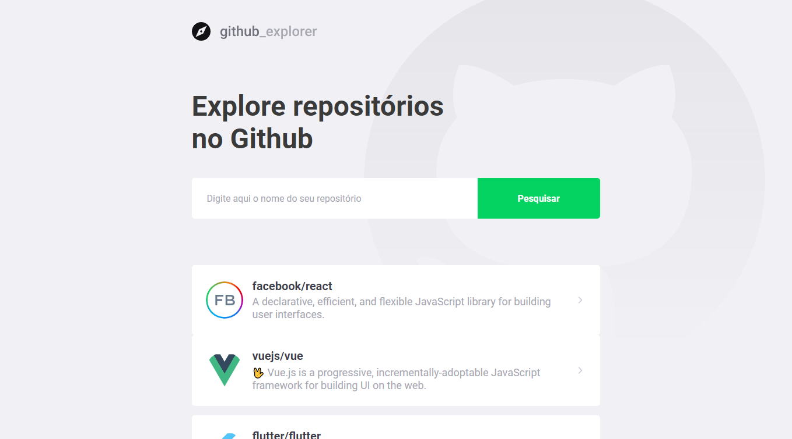

# Github Explorer

:octocat: Add a Github repository and get yours details and issues.

### [Live Demo](https://5ee823ca2a1bf49dfe2eb2b2--priceless-booth-709baf.netlify.app/)



## Installation

Use the package manager yarn to install.

```bash
yarn install
```

## Start

```bash
yarn start
```

## Contributing
Pull requests are welcome. For major changes, please open an issue first to discuss what you would like to change.

Please make sure to update tests as appropriate.

## License
[MIT](https://choosealicense.com/licenses/mit/)
